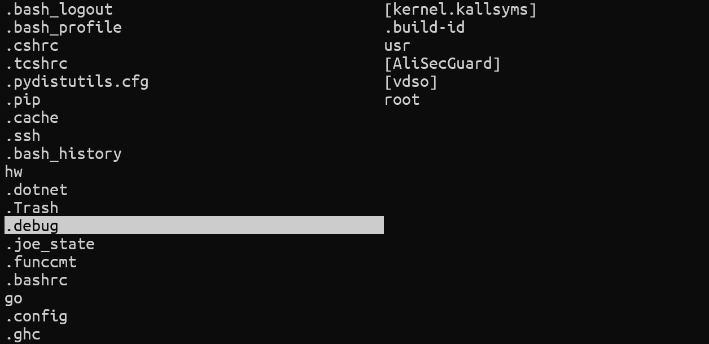

# Transgender



A TUI file explorer, written by a ranger hater.

## quick start

compile
```
make
```

and then enjoy
```bash
trans
```

keys:

|keys|function|
|:---:|:---:|
|o|go to directory under cursor|
|\<ENTER\>|go to directory under cursor|
|s|go to current directory(in left side window)|
|q|quit|
