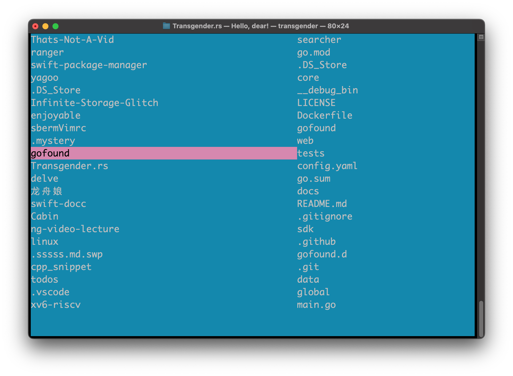

# Transgender



A minimalistic TUI file explorer with zero dependancy except libc, written by a [ranger](https://github.com/ranger/ranger) hater.

works on Linux & MacOS

## quick start

before compilation, make sure you have rust's environment installed, if not, goto [HERE](https://www.rust-lang.org/tools/install)

compile
```
make
```

refresh your shell configuration, or open up a new terminal window
```bash
# linux
source ~/.bashrc
# mac 
source ~/.bash_profile
```

enjoy
```bash
trans
```

keys:

|keys|function|
|:---:|:---:|
|o|go to directory under cursor|
|\<ENTER\>|go to directory under cursor|
|s|go to current directory(in left side window)|
|q|quit|


```
WHY DO I MAKE TRANS?

In my opinion trans is simpler than ranger. Creeping
featurism, growing size made ranger less attractive. 
Also, ranger is not a good software, it is filled
with bad designs that irritate its users.
```
