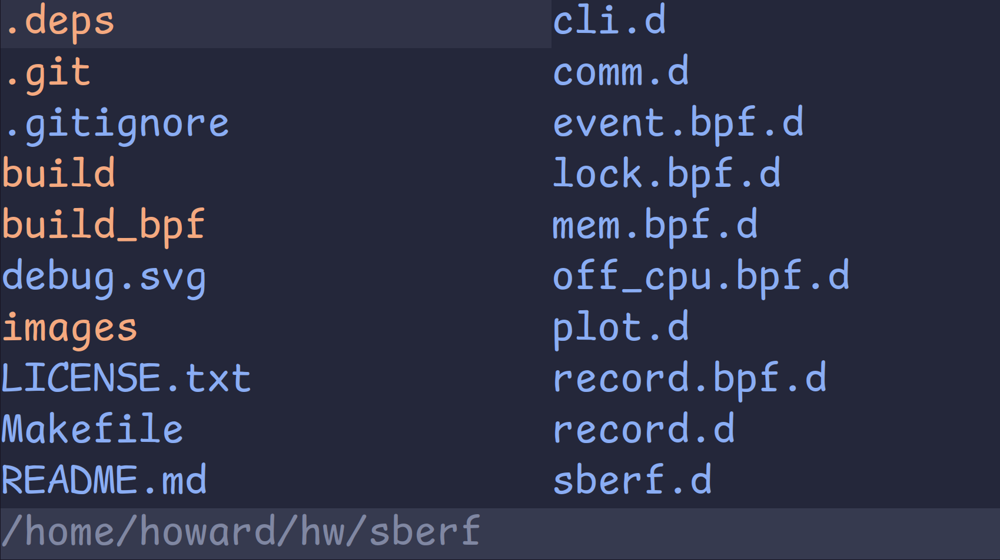
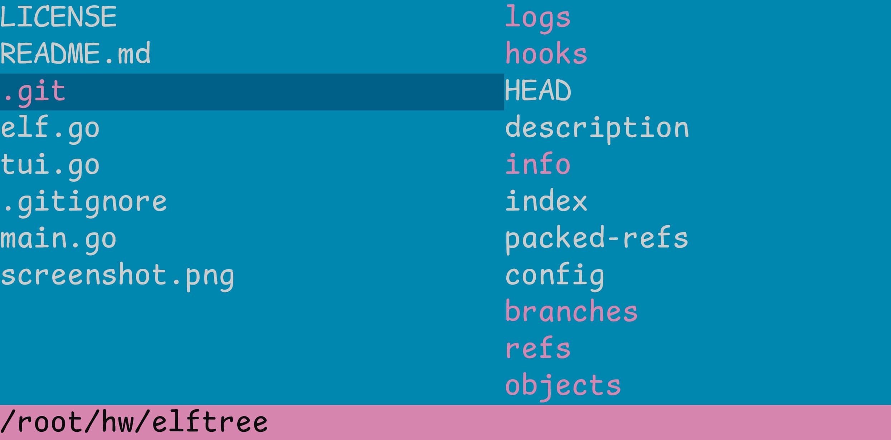
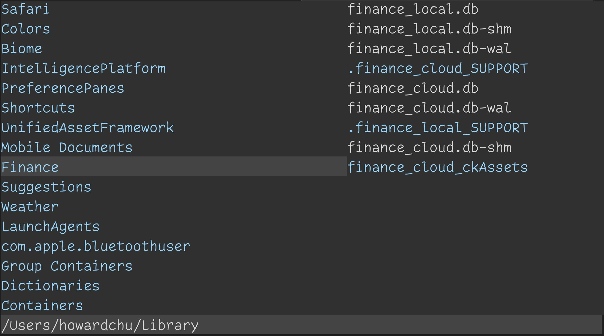
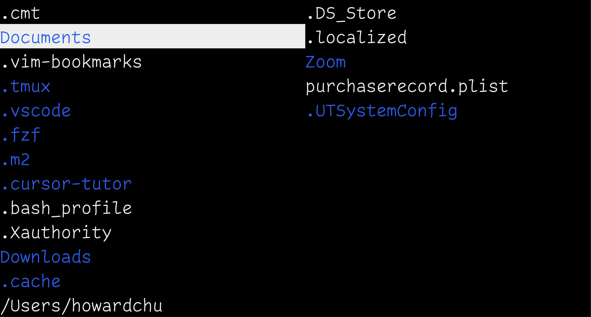

# Transgender.rs

[![version][version-badge]][version-url]

[version-badge]: https://img.shields.io/github/v/release/sberm/Transgender.rs
[version-url]: https://github.com/Sberm/Transgender.rs/releases

A minimalistic TUI file explorer with **minimal dependencies**, written by a [ranger](https://github.com/ranger/ranger) hater, works on Linux & MacOS.







## Quick start

### Installation

#### Arch Linux

[transgender](https://aur.archlinux.org/packages/transgender) is available as a package in the [AUR](https://aur.archlinux.org). you can install it using your preferred AUR helper. example:

```sh
paru -S transgender
```

### Compiling from source

clone the repo
```bash
git clone https://github.com/Sberm/Transgender.rs.git
```

before compilation, make sure you have rust's environment installed, if not, goto [HERE](https://www.rust-lang.org/tools/install)
<br/>

compile & install
```bash
cd Transgender.rs
make
make install
```

### Shell configuration

Currently only supports `bash` and `zsh`.

paste this shell script function into your shell configuration file, its location depends on which shell you use (`~/.bashrc`, `~/.bash_profile`, `source ~/.zshrc`)
```
eval "$(transgender --sh)"
```

refresh your shell configuration, or open up a new terminal window
```bash
# bash
source ~/.bashrc
# or
source ~/.bash_profile

# zsh
source ~/.zshrc
```

launch `Transgender.rs` with:
```bash
ts
```

<br/>

### Usage

| keys                             | function                                                            |
| :---:                            | :---:                                                               |
| hjkl(vim bindings) or arrow keys | scroll/enter/exit a directory                                       |
| o or \<ENTER\>                   | go to directory/open file under cursor                              |
| i                                | go to the current directory (in the left window)                    |
| q                                | quit                                                                |
| /                                | search                                                              |
| n / N                            | jump to the next/previous search match                              |
| Ctrl + U / Ctrl + D              | half pageup/pagedown                                                |
| (when in search mode) arrow keys | up/down for search history, left/right for editing the search query |

To open up a directory with trans
```bash
ts /usr/lib/
ts ..
ts /root
```

<br/>

### Config file

located at

```bash
~/.tsrc
```

**if `~/.tsrc` doesn't exist, you need to create one**

It supports changing the editor (opened with `o` or `ENTER`) and the theme.

An example of `~/.tsrc`:

```tsrc
# Set your preferred editor
editor = emacs

# 'open = ' has the same effect as 'editor = '
open = emacs

# Set your preferred theme
theme = dark
```

Because `o` and `ENTER` can both open files, you can specify their commands separately.
```tsrc
# The line below will be overridden by the following lines
editor = code

# Command to run after pressing 'o', this overrides 'editor = ' and 'open = '
o = open

# Command to run after pressing 'enter', this overrides 'editor = ' and 'open = '
enter = vim
```

Command line arguments are supported as well.
```tsrc
# Option value with whitespace, such as '--title "I Love Emacs"' is not supported yet
enter = emacs -nbc --no-desktop --title I-Love-Emacs
o = code --sync on --disable-lcd-text --disable-gpu
```

#### Editor

The specified editor will open when `o` or `ENTER` is pressed while the cursor is on a
file.

The default editor is `vi`; You can change it to `vscode` by adding this line into your
`~/.tsrc` file:
```tsrc
editor = code
```

`o` and `ENTER` can open different editors and programs, for example, press `o` to open `vim`,
and `enter` to open `emacs`. See the guide above for how to configure them using `.tsrc`.

#### Theme

The default theme is `lucius`.

`dark` theme:



Other themes:

* [catppuccin](https://imgur.com/a/mK2Toin)
* [trans](https://imgur.com/a/m4dmLig)
* [lucius](https://github.com/jonathanfilip/lucius)
* [acme](https://github.com/ianyepan/acme-emacs-theme)
* [sakura](https://imgur.com/a/5YhgVMG)
* [vscode](https://github.com/Mofiqul/vscode.nvim)
* [jesus](https://imgur.com/a/creZltw)
* [lucius-l](https://imgur.com/a/RyImZYW)

The theme name is case-insensitive; e.g., Catppuccin and catppuccin both work.

<br/>

### Searching

Searching is case-insensitive by default, use `<search term>\C` to search
case-sensitively. e.g. `README\C` will return the search result for `README.md`.

Now supports `>> regular expression <<`

`Trangender.rs` performs a search whenever a key is pressed in search mode

Due to the use of the `regex-lite` crate, the executable can be a bit bloated (
~504KB). If you don't need the regular expression feature, simply switch to the
vanilla version by checking out to the vanilla branch and building
`Transgender.rs` from there.

```bash
git checkout vanilla
make
make install
```

<br/>

### Uninstallation

if you want to uninstall `Transgender.rs`
```
make uninstall
```

<br/>

### Features:

* File exploration
* Changing directories
* Searching by file name
* Opening files with a preferred editor
* Multiple themes

```
WHY DID I MAKE TRANS?

In my opinion, Trans is simpler than ranger. Creeping
featurism and growing size have made ranger less
attractive. Additionally, ranger is not a good
software; it is filled with bad designs that irritate
its users.
```

<br/>

### Todo:

- [ ] Tests

- [x] Support for up arrow for search history, left and right arrow for navigation, and logic to properly display overflowed search text (show the rightmost part)

- [x] Decouple the utf8 length function get_utf8_len(), and use fewer .clone() in the new arrow key feature

- [x] Add support for zsh and other shells

- [x] Opening files with "open" command and so on

- [x] Bash completion

- [x] Read utf-8 input

- [x] Better full-width character handling

- [x] Config file to change text editor(default to vi)
