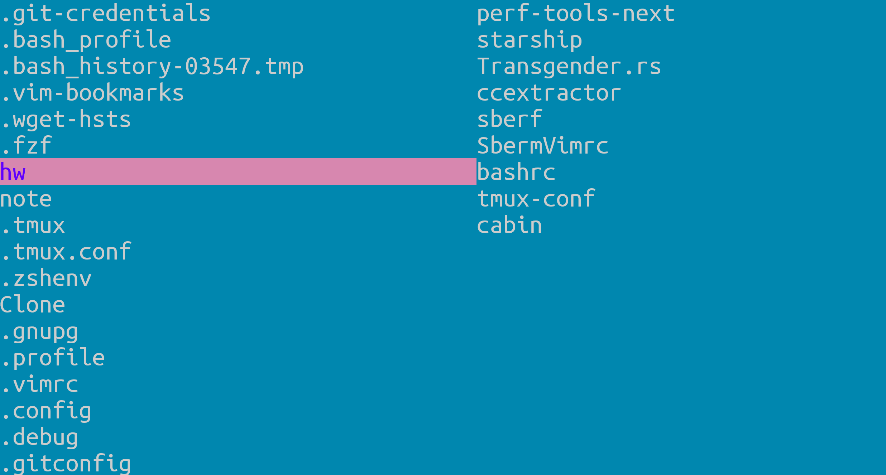
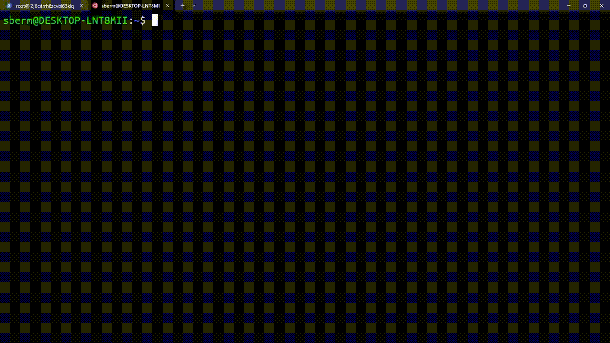

# Transgender

A minimalistic TUI file explorer with **zero dependencies** except libc, written by a [ranger](https://github.com/ranger/ranger) hater.

Works on Linux & MacOS





## quick start

before compilation, make sure you have rust's environment installed, if not, goto [HERE](https://www.rust-lang.org/tools/install)

compile
```
make
make install
```

put this line into your shell configuration file, depends on what shell you use (`~/.bashrc`, `~/.bash_profile`, `source ~/.zshrc`, `~/.config/fish/config.fish`)
```
alias ts='transgender 2>/tmp/trans && cd "`tail -n 1 /tmp/trans`"'
```

refresh your shell configuration, or open up a new terminal window
```bash
# bash
source ~/.bashrc
# or
source ~/.bash_profile

# zsh
source ~/.zshrc

# fish
source ~/.config/fish/config.fish

```

enjoy
```bash
ts
```

### keys:

| keys                             | function                                     |
| :---:                            | :---:                                        |
| hjkl(vim bindings) or arrow keys | scroll/enter/exit a directory                |
| o or \<ENTER\>                   | go to directory/open file under cursor       |
| s                                | go to current directory(in left side window) |
| q                                | quit                                         |
| /                                | search                                       |
| n                                | jump to next search match                    |

if you want to uninstall Transgender
```
make uninstall
```

### Features:

* file exploring
* cd to directories
* search directories

```
WHY DO I MAKE TRANS?

In my opinion trans is simpler than ranger. Creeping
featurism, growing size made ranger less attractive. 
Also, ranger is not a good software, it is filled
with bad designs that irritate its users.
```

### Todo:
- [ ] Read utf-8 input

- [ ] Better full-width character handling

- [ ] Config file to change text editor(default to vi)
